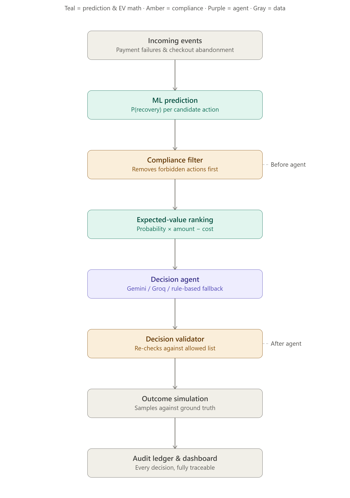

# Anchor — AI Revenue Recovery Agent

**Track 03 — AI Revenue Recovery.** An AI agent that identifies payment
failures and abandoned checkouts, chooses the highest-value recovery
action for each case, and executes it safely — enforcing compliance as
code the agent cannot see around, not a prompt instruction it might
ignore.

[Watch the 7-minute demo](https://drive.google.com/file/d/1gqjJNG468bX9NqSvYSePrBCSYh2sVB1U/view?usp=drive_link)



## The problem

Payments fail and checkouts get abandoned for many different reasons —
insufficient funds, OTP timeouts, gateway errors, price hesitation. Most
recovery systems either ignore this revenue or send everyone the same
generic reminder regardless of context. The gap isn't detecting failure —
it's knowing *which* intervention is worth taking for *this* customer, and
proving that choice was worth more than doing nothing or doing the same
thing for everyone.

## How it works

1. **ML prediction** — a trained model estimates recovery probability
   *per candidate action* (retry link, reminder, discount, escalation, no
   action) — not just "will this recover," but "will this recover if we
   do X."
2. **Compliance filter** — removes any forbidden action (opted-out
   customers, contact-frequency caps, quiet hours) from the candidate set
   *before* the agent ever sees it.
3. **Expected-value ranking** — turns probability into a real business
   decision: `P(recovery) × amount − intervention cost`.
4. **Decision agent** — an LLM (Gemini, with Groq and a deterministic
   rule-based path as fallbacks) picks and explains a choice from the
   already-filtered, EV-ranked candidates.
5. **Decision validator** — independently re-checks the agent's output
   against the same allowed list, correcting and flagging anything
   invalid.
6. **Outcome simulation + audit ledger** — every decision is scored and
   logged end to end, fully reconstructable after the fact.

Compliance is enforced two ways, both deterministic code: the agent is
never *offered* a forbidden action (pre-filter), and its actual output is
never *trusted blindly* (validator). Both are tested directly, not just
assumed.

## Results

Full 4,000-transaction batch, ₹17,07,076.43 total revenue at risk, same
population across all three policies:

| Policy | ₹ Recovered | Recovery Rate |
|---|---:|---:|
| Do nothing | ₹3,14,135.94 | 18.5% |
| Generic reminder (same message to everyone) | ₹6,44,189.16 | 38.2% |
| **Anchor (AI agent)** | **₹7,46,318.78** | **43.5%** |

**+₹4,32,182.84 recovered vs. doing nothing. +₹1,02,129.62 recovered vs.
the generic-reminder baseline** — the harder, more meaningful comparison,
since it's the obvious alternative any team could ship.

Compliance across this batch: **0 violations** — every opt-out respected,
every contact cap enforced, and quiet hours respected on every case except
a first response to an active payment failure (see Limitations).

## Tech stack

- **Backend:** FastAPI, SQLite
- **ML:** XGBoost (primary) + Logistic Regression (baseline)
- **Frontend:** React + Vite
- **Decision agent:** Gemini / Groq, provider-agnostic, structured JSON
  output enforced, deterministic rule-based fallback if no LLM is
  available or a call fails

## Running it

```bash
# Backend
cd backend
.venv/Scripts/python.exe -m uvicorn app.main:app --port 8000

# Frontend
cd frontend
npm install && npm run dev
# -> http://localhost:5173
```

`GEMINI_API_KEY` (optional — falls back to a deterministic rule-based
provider without it) goes in a `.env` file at the repo root or in
`backend/`.

## Limitations

- All financial outcomes are simulated against a synthetic ground-truth
  model, not real customer behavior.
- A single model uses `intervention` as a feature rather than separate
  per-action models — a reasonable MVP simplification.
- Quiet hours (9am–8pm) are enforced with one deliberate exception: the
  very first automated response to an active payment failure is allowed
  regardless of hour, since the customer is provably present
  mid-transaction. Abandoned checkouts and repeat attempts still respect
  the restriction.
- Compliance covers opt-out, a rolling contact cap, and quiet hours — not
  a complete regulatory implementation.

For the full build log, ML methodology, and engineering notes (including
what broke and how it was fixed), see [`STATUS.md`](STATUS.md) and
[`PROJECT_BRIEF.md`](PROJECT_BRIEF.md).
